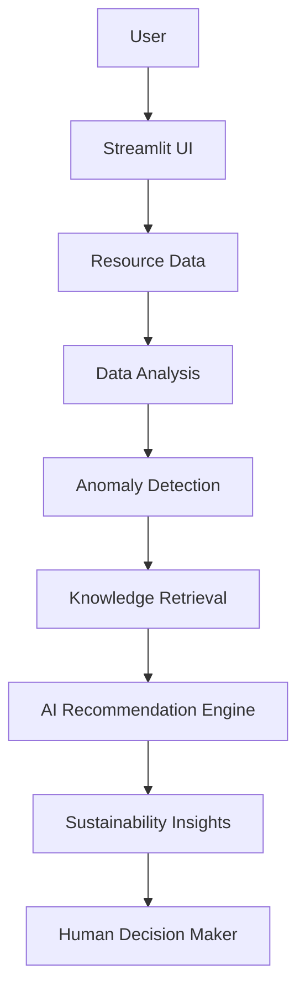

# EcoCampus AI

**Intelligent Campus Sustainability Assistant**
1M1B AI for Sustainability Virtual Internship

## Project Overview

EcoCampus AI is a working prototype Streamlit application that helps campus
administrators, faculty, sustainability coordinators, and students understand
electricity and water consumption patterns, spot unusual usage, and get
practical sustainability recommendations. It runs entirely locally on
synthetic demonstration data and requires no external API key.

## Problem Statement

Educational institutions consume electricity, water, and other resources
every day, but resource data is not always converted into understandable and
actionable sustainability insights.

## SDG Alignment

- **SDG 7** — Affordable and Clean Energy (primary)
- **SDG 11** — Sustainable Cities and Communities
- **SDG 12** — Responsible Consumption and Production
- **SDG 13** — Climate Action

## Target Users

- Campus administrators
- Facility / sustainability coordinators
- Faculty
- Students

## Features

1. **Dashboard** — consumption metrics, trend charts, and detected anomalies.
2. **AI Sustainability Assistant** — chat-style Q&A backed by local knowledge retrieval.
3. **Resource Analysis** — submit current readings and get an explainable anomaly check.
4. **Sustainability Report** — generate and download a Markdown summary report.
5. **Responsible AI** — privacy, transparency, fairness, and oversight notes.
6. **About Project** — problem statement, solution, SDGs, future scope.

## AI Components

- **Anomaly detection**: rule-based statistical thresholds (explainable, not a black box).
- **Lightweight RAG-style retrieval**: keyword matching against a local knowledge base.
- **Prototype AI recommendation engine**: local, rule-based response generation — clearly
  labeled as a prototype, not a live LLM. It works with zero API key and zero internet
  dependency.
- Optional external LLM integration is not required for the app to function.

## Lightweight RAG Workflow

```
User question
    ↓
Retrieve relevant knowledge (keyword matching over data/sustainability_knowledge.txt)
    ↓
Use retrieved context
    ↓
Generate recommendation (local prototype engine)
```

## Anomaly Detection

For each building, the app computes a historical average from the 30-day
synthetic dataset:

- **Electricity** is flagged when current usage is **more than 25% above** the
  building's historical average.
- **Water** is flagged when current usage is **more than 30% above** the
  building's historical average.

The app always displays the actual percentage difference and states
possible factors to investigate — it does not claim confirmed causes or
machine-learning-grade accuracy.

## Architecture



## Responsible AI

- **Privacy**: no personally identifiable student information is required.
- **Transparency**: anomaly detection uses disclosed statistical thresholds.
- **Fairness**: the system does not assign blame to a building or group without evidence.
- **Human oversight**: recommendations support, but do not replace, human decisions.
- **Data limitations**: synthetic demonstration data only.
- **Reliability**: external AI services are optional; a local fallback always works.

## Dataset

All data in this application is **synthetic** and generated inside `app.py`
using a fixed random seed (`42`) for reproducibility. It is not sourced from
any real campus. A handful of deliberate anomalies are injected so the
anomaly detection logic has something meaningful to surface.

## Installation

```
python -m venv venv
venv\Scripts\activate
pip install -r requirements.txt
streamlit run app.py
```

## GitHub Instructions

```
git init
git add .
git commit -m "Initial EcoCampus AI project"
git branch -M main
git remote add origin YOUR_GITHUB_REPOSITORY_URL
git push -u origin main
```

## Streamlit Deployment

1. Push this repository to GitHub (see above).
2. Go to [Streamlit Community Cloud](https://share.streamlit.io) and sign in with GitHub.
3. Click **New app**, select this repository and branch, and set the main file to `app.py`.
4. Click **Deploy**. No secrets or API keys are required for the app to run.

## Expected Impact

As a prototype, EcoCampus AI is intended to potentially improve resource
awareness among campus stakeholders and support more data-driven
conversations about sustainability. It does not currently measure or claim
any verified real-world environmental impact.

## Limitations

- Uses synthetic data, not live campus meters.
- Anomaly detection is a simple, explainable statistical rule, not a
  validated machine-learning model.
- The AI assistant is a local, keyword-based prototype, not a live LLM.
- Intended as a demonstration/prototype, not a production monitoring system.

## Future Scope

- IoT sensor integration
- Real-time electricity monitoring
- Water sensors
- Carbon footprint estimation
- Renewable energy monitoring
- IBM Granite integration
- Advanced predictive models
- Multi-campus analytics

## Author

**Sabarni Guha**
B.Tech CSE (AI & ML), IEM-UEM
1M1B AI for Sustainability Virtual Internship
